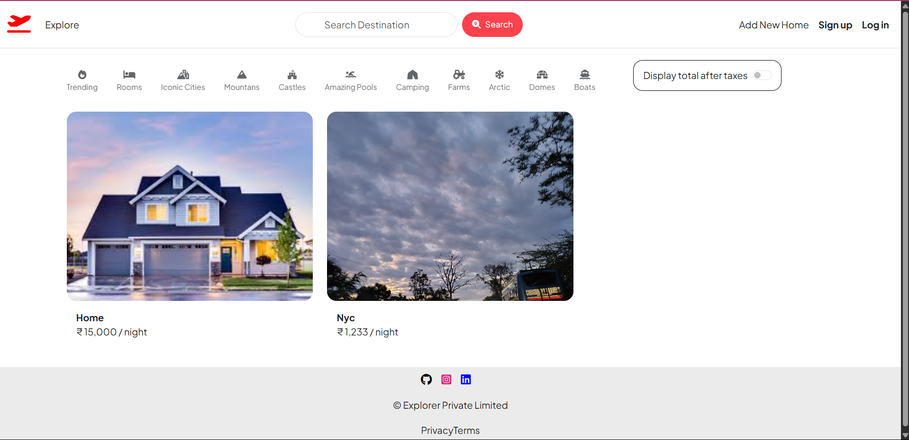
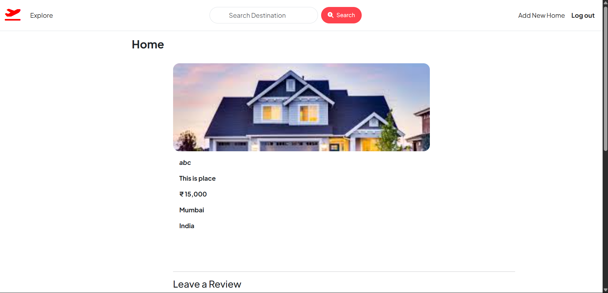
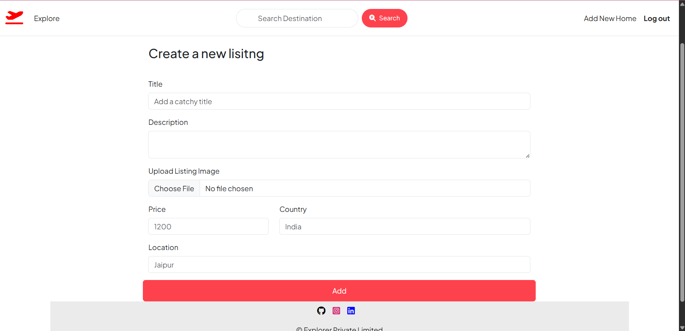
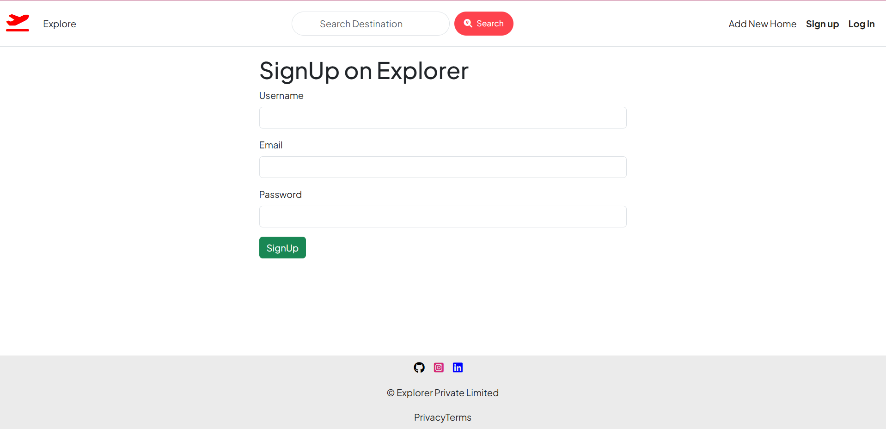

# 🏡 HomeRent - Property Listing & Rental App



---

## 📌 Overview

**HomeRent** is a full-stack rental property listing web application inspired by platforms like Airbnb. Built using the **MERN stack** (MongoDB, Express, Node.js) — without React — the app allows users to:

- 🧑‍💼 Register and log in securely  
- 🏘️ Add, view, edit, and delete rental listings  
- 🖼️ Upload property images  
- 🧠 Maintain clean code using **MVC architecture**

The project is designed for clean scalability and real-world usability using dynamic server-rendered templates.

---

## 🚀 Features

- 🔐 **User Authentication**
  - Secure sign-up and login functionality
  - Passwords are hashed using bcrypt
  - Session-based authentication

- 🏠 **Property Listings**
  - Add new listings with title, location, price, image, and description
  - Edit or delete existing listings
  - View all listings on the home page

- 📸 **Image Uploads**
  - Upload images via form
  - Image files stored locally

- 🧠 **MVC Architecture**
  - `Models`: Mongoose schemas for User & Listing
  - `Views`: EJS templates for pages
  - `Controllers`: Logic separated from routes

---

## 🛠️ Tech Stack

- ⚙️ **Backend**: Node.js + Express.js  
- 🗄️ **Database**: MongoDB with Mongoose  
- 🖥️ **Templating**: EJS (or Pug / Handlebars if preferred)  
- 🔐 **Auth**: express-session + bcrypt  
- 🗂️ **Image Upload**: Multer  
- 🧩 **Architecture**: MVC (Model-View-Controller)

---

## 🧱 Folder Structure

HomeRent/
├── controllers/
├── models/
├── routes/
├── views/
├── public/
├── uploads/
├── app.js
├── package.json
├── README.md
├── home.png
├── view.png
├── signup.png
├── add.png


---

## 🖼️ Screenshots

### 🏡 Home Page  


---

### 🔍 Show / View Listing Page  


---

### 📝 Add Listing Page  


---

### 🧑‍💻 Signup Page  


---

## 🧪 How to Run Locally

1. 🔁 **Clone the repository**

   ```bash
   git clone https://github.com/yourusername/homerent.git
   cd homerent

npm install

MONGO_URI=your_mongodb_connection_string
SESSION_SECRET=your_session_secret

npm start

https://explorerk.onrender.com/listings\


🔮 Future Improvements
🌍 Google OAuth login

🗺️ Map-based location picker

☁️ Upload images to Cloudinary

📊 Admin dashboard for managing users & listings


👨‍💻 Author
Built with 💙 Harshit Khandelwal


---

✅ **What to do next:**

- Make sure these 4 image files are in your root folder:
  - `home.png`
  - `view.png`
  - `signup.png`
  - `add.png`
- Replace Harshit Khandelwal and GitHub URL with your own


